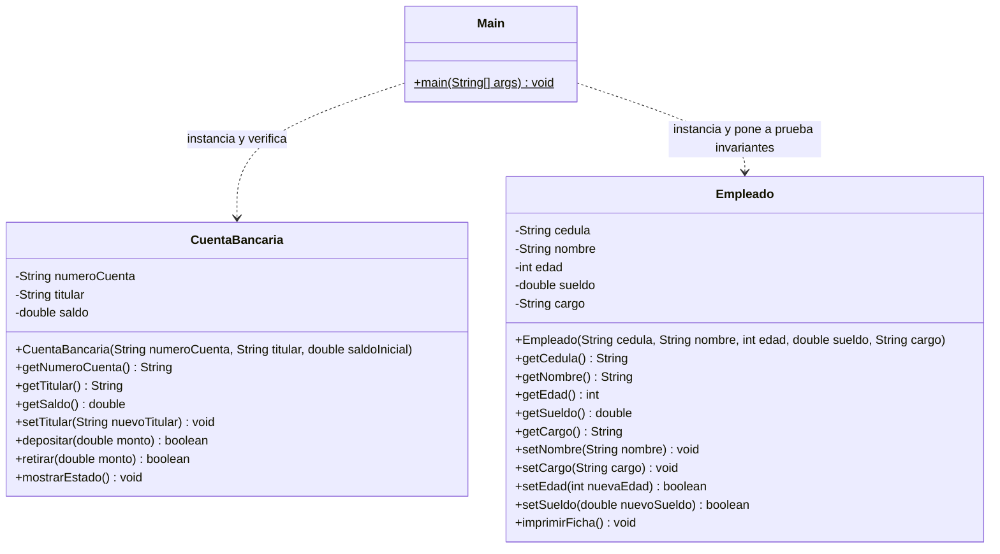
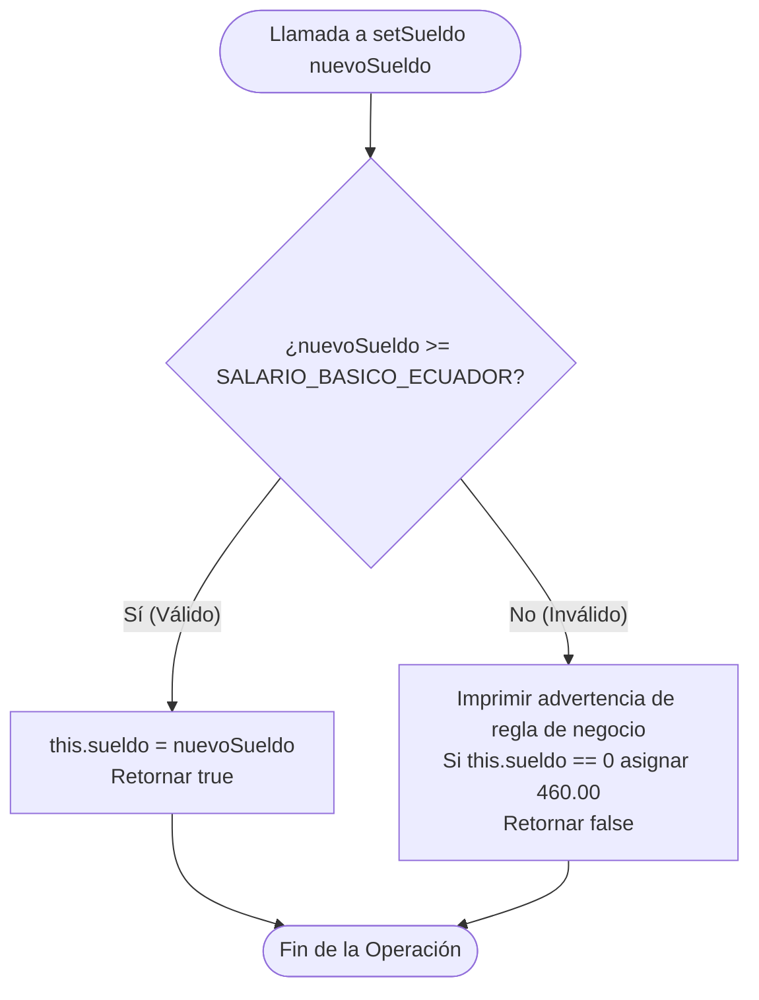

# Guía del Taller Práctico para el Estudiante: Encapsulamiento e Invariantes en Java

```text
========================================================================================
ESCUELA SUPERIOR POLITÉCNICA AGROPECUARIA DE MANABÍ MANUEL FÉLIX LÓPEZ (ESPAM MFL)
CARRERA DE COMPUTACIÓN / SOFTWARE • MODALIDAD EN LÍNEA
Asignatura: Programación Orientada a Objetos (CDS-0201)
Docente:    Luiggi Alexander Jalca Saltos
Semestre:   Segundo Semestre "A" • Periodo Académico 2026-2027
Semana 1:   Sesión 02 (3 Horas) • Taller Práctico y Actividad Autónoma
========================================================================================
```

---

## 🎯 1. ¡Bienvenido/a al Taller Práctico de POO!

Estimado/a estudiante, en esta sesión práctica aprenderás a implementar y defender en código ejecutable los pilares fundamentales del **Paradigma Orientado a Objetos (POO)** utilizando **Visual Studio Code** y **Java (JDK 17 LTS)**.

A través de este taller conectarás la teoría de diseño de software con la programación profesional:
1. **Encapsulamiento e Information Hiding:** Proteger el estado interno de tus objetos marcando sus atributos como `private`.
2. **Definición de Invariantes de Clase:** Reglas lógicas y de negocio que deben mantenerse verdaderas durante toda la existencia del objeto (por ejemplo, saldo bancario no negativo o salario laboral superior al Salario Básico Unificado).
3. **Interfaz Pública como Barrera de Validación:** Diseñar métodos públicos (`public`) como Getters y Setters que actúen como "guardias aduaneros" frente a intentos de corrupción de datos.
4. **Desarrollo Autónomo:** Completar la clase `Empleado.java` aplicando validaciones estrictas requeridas en la planificación docente del SGA (1.0 Hora TA).

---

## 📂 2. Estructura de tu Proyecto en VS Code

Abre esta carpeta en Visual Studio Code. Encontrarás la siguiente distribución organizada de archivos:

```text
codigoestudiante/
│
├── README.md                      <- Esta guía de trabajo para el estudiante
│
└── src/                           <- Código fuente Java
    ├── CuentaBancaria.java        <- Clase guiada: Encapsulamiento y operaciones financieras
    ├── Empleado.java              <- Clase del taller autónomo: Invariantes a implementar
    └── Main.java                  <- Banco de pruebas por consola para verificar tu código
```

---

## 🏗️ 3. Diagrama de Clases UML del Sistema

A continuación se presenta el modelo UML de clases del proyecto, donde `-` denota miembros privados y `+` miembros públicos:



---

## 🛡️ 4. La Barrera de Encapsulamiento (Modelo Mental)

El encapsulamiento no consiste simplemente en colocar la palabra `private` en cada atributo. Su propósito de ingeniería es construir una **bóveda blindada** alrededor del estado del objeto, impidiendo que código externo altere las variables de forma arbitraria o inconsistente.

### Arquitectura de la Cápsula y la Aduana de Métodos:

```text
  MUNDO EXTERIOR (Clase Main / Clientes / UI / Red)
  ─────────────────────────────────────────────────────────────────────────────
        │                                                     ▲
        │ 1. Intento de acceso directo:                       │ 3. Consulta segura:
        │    cuenta.saldo = -50000;                           │    double s = cuenta.getSaldo();
        │    ❌ ERROR DE COMPILACIÓN (Bloqueado por Java)     │    ✓ PERMITIDO
        ▼                                                     │
  ═════════════════════════════════════════════════════════════════════════════
  BARRERA DE ACCESO (MÉTODOS PÚBLICOS 'public' - ADUANA / GUARDIANES)
  ═════════════════════════════════════════════════════════════════════════════
        │                                                     │
        │ 2. Mutación validada:                               │
        │    cuenta.retirar(700);                             │
        │    Evalúa: (monto > 0 && monto <= saldo)            │
        ▼                                                     │
  ┌───────────────────────────────────────────────────────────────────────────┐
  │ BÓVEDA INTERNA PRIVADA ('private' - ESTADO PROTEGIDO)                     │
  │                                                                           │
  │   - numeroCuenta: "CTA-001"                                               │
  │   - titular:      "Estudiante 1"                                          │
  │   - saldo:        $ 500.00                                                │
  │                                                                           │
  │   ✓ INVARIANTE GARANTIZADA: El saldo jamás puede ser negativo.            │
  └───────────────────────────────────────────────────────────────────────────┘
```

### Ejemplos Conceptuales Discutidos en Clase:
- **Vida Real 1 (Cajero Automático ATM):** La caja fuerte con billetes es `private`; la ranura dispensadora y el teclado numérico con validación de PIN son la interfaz `public`.
- **Vida Real 2 (Motor de un Automóvil):** El sistema de combustión interna es `private` bajo el capó; el acelerador y el volante son los métodos `public`.
- **Software 1 (FinTech / Banca Móvil):** El balance de la cuenta no se puede modificar desde el navegador con un formulario; viaja a través de una transacción validada en el backend.
- **Software 2 (Seguridad / Autenticación):** El hash de la contraseña es `private`; solo se expone `login(usuario, password)` que devuelve `true` o `false`.

---

## 🔍 5. Componentes del Proyecto

### 5.1. `CuentaBancaria.java` (Entidad Financiera Blindada)
Esta clase ya viene completamente implementada como referencia guiada del docente:
- Contiene los atributos privados `numeroCuenta`, `titular` y `saldo`.
- Métodos `depositar(double monto)` y `retirar(double monto)` que verifican que los montos sean estrictamente positivos y que no existan retiros que superen el saldo actual (bloqueo de sobregiro).
- Método `mostrarEstado()` para auditar el estado del objeto en consola.

### 5.2. `Empleado.java` (Tu Reto Autónomo)
Esta plantilla contiene la estructura base, atributos y constructor, pero tiene secciones marcadas con **`TODO`** que tú debes programar.

---

## 📋 6. Reto de Trabajo Autónomo: Implementar Invariantes en `Empleado.java`

```text
========================================================================================
FICHA OFICIAL DE TRABAJO AUTÓNOMO (SGA - SEMANA 1)
Asignatura:       Programación Orientada a Objetos (CDS-0201)
Actividad:        Taller Práctico Individual de Invariantes Laborales
Acreditación:     1.0 Hora de Trabajo Autónomo (Componente TA 30%)
Archivo a editar: src/Empleado.java
========================================================================================
```

### 6.1. Reglas de Negocio a Implementar

En el archivo `src/Empleado.java` debes completar la lógica de los siguientes dos métodos mutadores:

#### Reto 1: `public boolean setEdad(int nuevaEdad)`
- **Regla Invariante:** La edad de una persona contratada debe estar dentro del rango laboral legal en Ecuador: **entre 18 y 70 años** (inclusive).
- **Si es válida:** Asigna el nuevo valor a `this.edad` y retorna `true`.
- **Si NO es válida:** Emite un mensaje de error explicativo por consola, asigna un valor por defecto seguro (18) si el atributo aún no estaba inicializado, y retorna `false`.

#### Reto 2: `public boolean setSueldo(double nuevoSueldo)`
- **Regla Invariante:** El sueldo no puede ser menor a la constante `SALARIO_BASICO_ECUADOR` (**$460.00**).
- **Si es válido:** Asigna el nuevo valor a `this.sueldo` y retorna `true`.
- **Si NO es válido:** Emite un mensaje de error explicativo por consola, asigna un valor por defecto seguro (460.00) si el atributo aún no estaba inicializado, y retorna `false`.

---

### 6.2. Diagrama de Flujo: Validación de Invariantes

Guíate en este diagrama de flujo para diseñar tu condicional `if/else`:



---

## 🚀 7. Instrucciones para Ejecutar y Probar tu Código

### Opción A: Desde Visual Studio Code (Modo Gráfico)
1. Abre la carpeta `codigoestudiante` en **Visual Studio Code**.
2. Abre el archivo `src/Main.java`.
3. Haz clic en el botón **▶ "Run Java"** ubicado en la esquina superior derecha del editor.
4. Observa los mensajes impresos en la consola integrada de VS Code.

### Opción B: Desde la Terminal Integrada de VS Code
Abre la terminal con `` Ctrl + ` `` y escribe:

```powershell
# 1. Asegúrate de estar ubicado en la carpeta codigoestudiante:
# 2. Compilar todas las clases dentro de src:
javac src/*.java

# 3. Ejecutar la clase principal Main:
java -cp src Main
```

---

## 📊 8. Salida Esperada por Consola al Completar el Taller

Cuando hayas completado correctamente los métodos `setEdad` y `setSueldo` en `Empleado.java`, la ejecución de `Main.java` deberá mostrar la siguiente salida:

```text
=======================================================================
  ESPAM MFL - PROGRAMACION ORIENTADA A OBJETOS (CDS-0201)
  Docente: Luiggi Alexander Jalca Saltos
  Taller Practico: Encapsulamiento, Modificadores e Invariantes
=======================================================================

>>> PARTE 1: Proteccion del Estado con Encapsulamiento (CuentaBancaria)
  Creando cuenta de ahorros para Estudiante 1 con $500.00:
  [ESTADO CUENTA] No. CTA-001-2026 | Titular: Estudiante 1 | Saldo: $500.00

  1. Intento de operacion legitima (Deposito de $150.00):
  [DEPOSITO EXITOSO] Se ingresaron $150.00 a la cuenta CTA-001-2026. Saldo actual: $650.00

  2. Intento de operacion invalida (Deposito negativo de -$50.00):
  [ERROR] El monto a depositar debe ser mayor a cero.

  3. Intento de retiro legitimo (Retiro de $200.00):
  [RETIRO EXITOSO] Se retiraron $200.00 de la cuenta CTA-001-2026. Saldo actual: $450.00

  4. Intento de sobregiro invalido (Retiro de $900.00 excediendo saldo):
  [ERROR] Fondos insuficientes. Saldo disponible: $450.00 | Monto solicitado: $900.00

  Estado final de la cuenta protegida:
  [ESTADO CUENTA] No. CTA-001-2026 | Titular: Estudiante 1 | Saldo: $450.00

>>> PARTE 2: Prueba de Invariantes en Empleado (Taller Autonomo)
  Registrando empleado inicial de prueba:
  [EMPLEADO] Cedula: 1312345678 | Nombre: Estudiante 2 | Edad: 28 anios | Cargo: Desarrollador Junior | Sueldo: $850.00

  [PRUEBA 1] Intento de violar invariante de edad (14 anios - menor de edad):
  [ERROR INVARIANTE] Edad invalida (14 anios). Debe estar en el rango legal de 18 a 70 anios.

  [PRUEBA 2] Intento de violar invariante de salario ($200.00 < SBU $460.00):
  [ERROR INVARIANTE] El sueldo ($200.00) no puede ser menor al SBU de Ecuador ($460.00).

  [PRUEBA 3] Asignacion de valores legitimos (29 anios, $950.00):
  [EMPLEADO] Cedula: 1312345678 | Nombre: Estudiante 2 | Edad: 29 anios | Cargo: Desarrollador Junior | Sueldo: $950.00

=======================================================================
  [TALLER FINALIZADO] Revisa que las invariantes no permitan datos corruptos
=======================================================================
```

---

> [!TIP]
> **Consejo de Aprendizaje:**
> Experimenta en `Main.java` creando un nuevo empleado con tus propios datos de prueba. Observa qué sucede si intentas asignarle un salario de \$100 o una edad de 95 años. ¡Tu código debe ser capaz de proteger la integridad del sistema!
